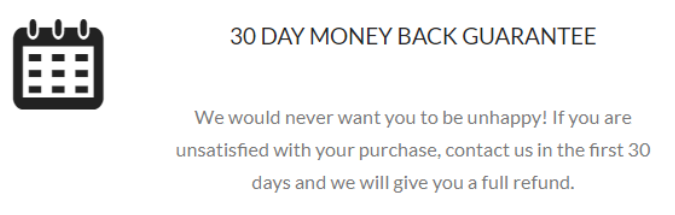
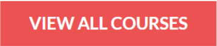
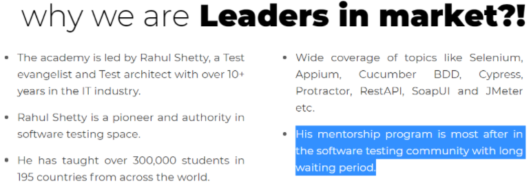

# Tech Challenge for QA Automation Engineer

Thanks for your interest in joining Stori. At this stage, we ask you to solve the following challenge. Best of luck!

For this challenge you should use python; but if you don’t know python very well you can use any language that you're comfortable with. You can create “pure” code or use an automation framework like Selenium. 

### Test Cases
All of the following test cases should be in a Requirement Traceability Matrix (RTM) with all the information you consider necessary.

### Tests Execution
You script should be able to run in Chrome, Firefox or Opera browsers. In addition to your script, create a bash script that executes your primary script. The bash script should be parameterized to include the browser name. For example: 
```bash
stori_test.py --browser firefox
```

### Tests Components
The test script should execute the following tasks:

1. Go to [https://rahulshettyacademy.com/AutomationPractice/](https://rahulshettyacademy.com/AutomationPractice/)

2. In the Suggestion Class Example, enter the word “Me” and select Mexico.

3. In the Switch Window Example, click the Open Window button. If the 30 day money back guarantee text (example below) is not shown, fail the test. Close the new window.



4. In the Switch Tab Example, click the Open Tab button.  Scroll on the new tab until you see the button below. Then take a screenshot that includes the button and save it with the name of the test case that you gave in the RTM. Don't close the window. Return to the first window.



5. In the Switch To Alert Example, type this string “Stori Card” and click the Alert button. Print the text in the alert and click on OK. Then type the same string and click on the Confirm button and print the text. Make sure that the string shown equals this “Hello Stori Card, Are you sure you want to confirm?” if not fail the test, then click on OK.

6. Print the names of all the Engineers in the Web Table Fixed header.

7. In the iFrame example, get the text highlighted in blue in the following image and print it.



8. Make an HTML report with all the test cases statuses and save it in a folder called “reports".
